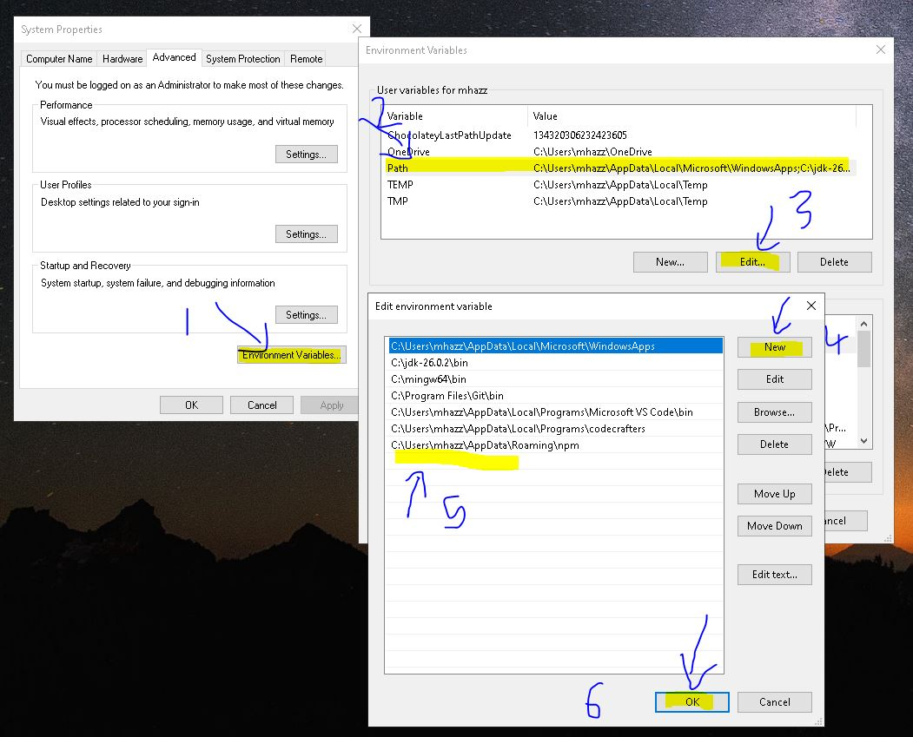

# Enviroment Path Calculator
It is a C++ set of programs used to calculate numbers in terminals through environment variables path

### Project Structure
```
envpath-calculator/
├── Makefile # Build automation script
├── README.md # Documentation
├── src/ # Source files (one calculator utility per file)
│ └── *.cpp
├── bin/ # Output directory for compiled executables
│ └── *.exe
```

---

### How to Test

1. **first clone the project**
```bash
git clone https://github.com/gmhazza/envpath-calculator.git
cd ./envpath-calculator
```

2. **Build the project**
* on windows (mingw)
```bash
mingw32-make
```
* on linux
```sh
make
```
final build will be in bin directory

3. **Setting up Environment**
* Copy a path of bin directory inside project. "C:/projects/envpath-calculator/bin"
* Open the Advance System Settings and follow the following set of instructions


4. Test
* Open Terminal and type 
```
add --help
```
if it execute then you have successfuly installed the program